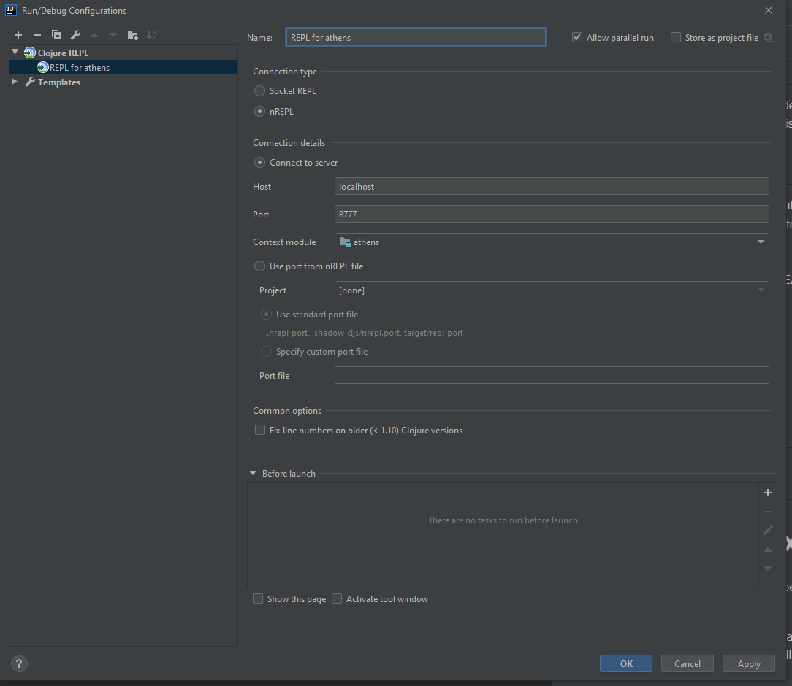
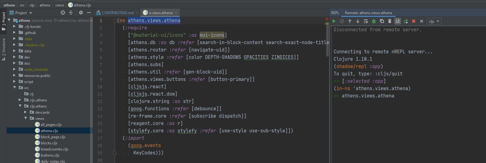

# Table of Contents

- [Contributing to Athens](#contributing-to-athens)
- [Running Athens Locally](#running-athens-locally)
- [Deploying Athens and Devcards](#deploying-athens-and-devcards)
  * [Automated Deploys](#automated-deploys)
  * [Manual Deploys](#manual-deploys)
- [Connecting your REPL](#connecting-your-repl)
  * [Cursive](#Cursive)
  * [Cider](#Cider)
  * [Calva](#Calva)
  * [Fireplace](#Fireplace)
- [Using re-frame-10x](#using-re-frame-10x)
- [Running CI Scripts Locally](#running-ci-scripts-locally)
  * [Testing](#testing)
  * [Linting](#linting)
  * [Clojure Styling](#clojure-styling)
  * [Unused Variable Checking](#unused-variable-checking)
- [Git and GitHub Style Guide](#git-and-github-style-guide)
  * [Commits](#commits)
  * [Issues](#issues)
  * [Pull Requests](#pull-requests)
  
---

# Contributing to Athens

Whether you are a designer, developer, or have other superpowers, please see our [v1 Project Board](https://github.com/athensresearch/athens/projects/2) to see what we're working on.

- The best place to reach us is our [Discord](https://discord.gg/GCJaV3V)! 👾
- Read [Product Development at Athens](https://www.notion.so/athensresearch/Product-Development-at-Athens-4c99e37d1713441c99360668c39e5db7) to see our shipping philosophy. It's more nuanced than just "agile", with some inspiration from Basecamp. 🛠

# Running Athens Locally

These dependencies are needed to get Athens up and running. To install them, follow the instructions in the links.

1. [Java 11 and Leiningen](https://purelyfunctional.tv/guide/how-to-install-clojure/) (Leiningen installs Clojure)
1. [Node 12](https://nodejs.org/en/download/) and [Yarn](https://classic.yarnpkg.com/en/docs/install/#mac-stable)

After you've got these dependencies, clone the Git repository to your hard drive:

```
git clone https://github.com/athensresearch/athens.git
```

Then `cd athens/` and run the following commands.

Pull JavaScript dependencies:

```
yarn
```

Pull Java dependencies and build, then start a local HTTP server for Athens:

```
lein dev
```

When these scripts are done, your terminal will read `build complete`. Athens can then be accessed by pointing a browser to http://localhost:3000/ on UNIX or http://127.0.0.1:3000/ on Windows.

# Deploying Athens and Devcards

You should deploy your version of Athens and [Devcards](https://github.com/bhauman/devcards) if you are making UI-releated pull requests to Athens. This will allow developers and designers to interact with your code, which is essential for reviewing UI changes.

Athens Devcards can be found at https://athensresearch.github.io/athens/cards.html.

## Automated Deploys

We've setup GitHub Actions so that each time you commit to your fork on GitHub, GitHub Actions automatically lints, tests, and styles your code.

If these scripts pass, GitHub builds your code and then deploys it to https://YOUR_GITHUB.github.io/athens/ and https://YOUR_GITHUB.github.io/athens/cards.html.

To begin doing automated deploys, just make sure your Actions are enabled at https://github.com/YOUR_GITHUB/athens/actions. Then start pushing code!

## Manual Deploys

To build and deploy Athens and Devcards from your local development environment:

1. Build your JavaScript bundle(s) with either `lein dev`, `lein devcards`, or `lein compile`.
1. Run `lein gh-pages`.
1. Open http://<YOUR_GITHUB>/github.io/athens/ and http://<YOUR_GITHUB>/github.io/athens/cards.html. Sometimes this takes a minute to be updated.

Notes:

- If you want to compile Athens and Devcards one time without hot-reloading, run `lein compile`.
- If you are actively developing Athens and not Devcards, run `lein dev` to hot-reload the Athens application.
- If you are actively developing DevCards and not Athens, run `lein devcards` to hot-reload Devcards.
- If you want to build Athens and Devcards, because you are testing a component on DevCards and Athens at the same time, you should run `lein dev` and `lein devcards` in two terminals.
- If both builds are running, it doesn't matter which port you go to (i.e. `3000` or `3001`), because both HTTP servers can serve assets.
- More docs should be written in the future on how to connect a REPL to either build, depending on your text editor.

# Connecting your REPL

* Refer shadow-cljs documentation for more details related to [editor integration](https://shadow-cljs.github.io/docs/UsersGuide.html#_editor_integration).
* nREPL port information can be found in [shadow-cljs.edn](https://github.com/athensresearch/athens/blob/master/shadow-cljs.edn) file.
* Make sure you can run [athens locally](#Running Athens Locally) before proceeding with this section.

## Cursive
Follow Cursive [user guide](https://cursive-ide.com/userguide/index.html) to install the plugin.
After, installing cursive plugin follow the below instructions to set up the cljs REPL.
1. Navigate to the root directory and execute `npx shadow-cljs pom`.
2. Then in Intellij File → New → Project from Existing Sources then select the generated pom.xml in the project directory.
3. Start the local http server `lein dev`
4. Once the project has been opened in Intellij IDEA, Run → Edit Configurations.
5. \+ → Clojure REPL → Remote
6. Name: REPL for athens

   Connection type: nREPL

   Connection details: Host: localhost, Port: 8777 (port number defined in the shadow-cljs.edn file)

7. Run → Run and select the created nREPL configuration.
8. Once the clj REPL is started run `(shadow/repl :app)` to switch to cljs REPL.



## CIDER
- [ ] TODO

## Calva
- [ ] TODO

## Fireplace
- [ ] TODO

# Using re-frame-10x

The right sidebar has [`re-frame-10x`](https://github.com/day8/re-frame-10x/tree/master/src/day8) developer tools. You can toggle it open and close with `ctrl-h`.

This is useful for inspecting the state of re-frame apps. However, we are currently reducing usage on re-frame-10x because it doesn't work well with datascript ([#139](https://github.com/athensresearch/athens/issues/139)).


# Running CI Scripts Locally

After each submitted PR to Athens, GitHub Actions runs the continuous integration workflow declared in `.github/workflows/build.yml`. This workflow runs scripts from [`script/`](script) to test, lint, and build Athens. You can see these workflows in practice in the [Actions tab](https://github.com/athensresearch/athens/actions/).

However, it's a lot faster if you run these tests locally, so you don't have to submit a PR each time to make sure the workflow succeeds. You may need to install additional dependencies, though.

## Testing

No additional installation is needed. Just run this:

```
lein test
```

The output will look something like this:

```
$ lein test

Testing athens.block-test

Testing athens.parser-test

Testing athens.patterns-test

Ran 4 tests containing 16 assertions.
0 failures, 0 errors.
```

## Linting

We are linting Clojure code using [clj-kondo](https://github.com/borkdude/clj-kondo). Our clj-kondo configuration is in [`.clj-kondo/config.edn`](.clj-kondo/config.edn).

For this linting to work, you will need to install `clj-kondo`. Instructions are in [`clj-kondo`’s installation guide](https://github.com/borkdude/clj-kondo/blob/master/doc/install.md).

To see the problems reported by clj-kondo, run `script/lint`. Example run:

```
$ script/lint
linting took 257ms, errors: 0, warnings: 0
```

Your editor may also be able to integrate with clj-kondo’s output. For example, if you use [Calva](https://marketplace.visualstudio.com/items?itemName=betterthantomorrow.calva) for VS Code, then clj-kondo’s messages are reported in the Problems panel.

## Clojure Styling

To format your code or check that your code is formatted correctly, you will need to use `cljstyle`. Instructions for installing it are [in `cljstyle`’s README](https://github.com/greglook/cljstyle/tree/master#installation).

To check if your Clojure code is formatted correctly, run `cljstyle check`. If there is no output and the return code is zero, you’re good. You can also run `script/style`, but currently it only works if you’re running Linux.

To reformat all your Clojure files in place, run `cljstyle fix`.

## Unused Variable Checking

To set this up, first make sure that a global `clojure` binary is installed. You won’t necessarily have a `clojure` binary installed just because you installed Leiningen.

Next, just run `script/carve`. The first time you run it it will download [Carve](https://github.com/borkdude/carve) as a dependency, which takes about a minute and outputs lots of messages. On subsequent runs `script/carve` won’t output anything unless an unused variable was found.

# Git and GitHub Style Guide

## Commits

Follow guidelines from [Conventional Commits](https://www.conventionalcommits.org/en/v1.0.0/). Specifically, begin each commit with one of the following types:

```
build:
ci:
chore:
docs:
feat:
fix:
perf:
refactor:
revert:
style:
test:
```

See some real examples in our [commit history](https://github.com/athensresearch/athens/commits/master).

## Issues

Please create issues using [our templates](https://github.com/athensresearch/athens/issues/new/choose). However, you will almost certainly get feedback and help faster in our [Discord](https://discord.gg/GCJaV3V)!


## Pull Requests

If your PR is related to other issue(s), reference it by issue number. You can close issues smoothly with [GitHub keywords](https://help.github.com/en/enterprise/2.16/user/github/managing-your-work-on-github/closing-issues-using-keywords):

```
close #1
fix #2
resolve #2
```

This repo only allows those with merge permissions to "Squash and Merge" PRs. This makes reverts easier if they are needed.
