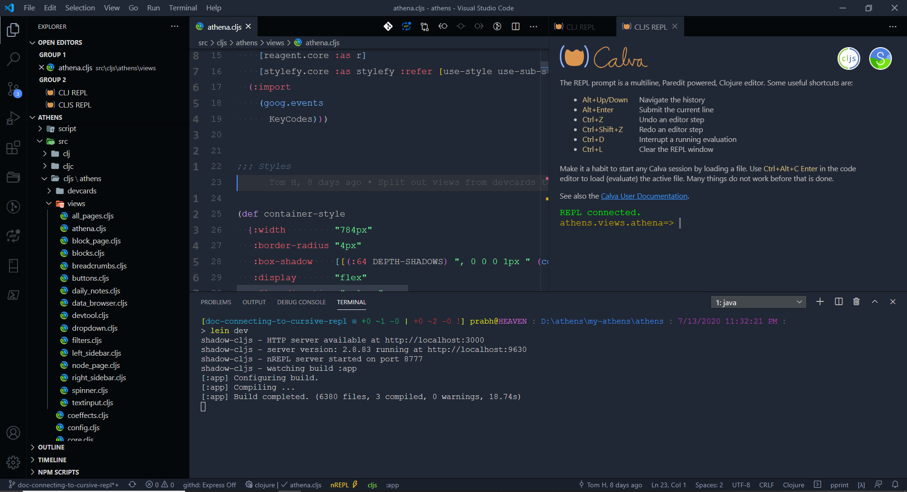

# Table of Contents

- [Contributing to Athens](#contributing-to-athens)
  * [Developers](#developers)
  * [Designers](#designers)
  * [Others](#others)
- [Running Athens Locally](#running-athens-locally)
- [Deploying Athens and Devcards](#deploying-athens-and-devcards)
  * [Automated Deploys](#automated-deploys)
  * [Manual Deploys](#manual-deploys)
- [Connecting your REPL](#connecting-your-repl)
  * [Cursive](#cursive)
  * [CIDER](#cider)
  * [Calva](#calva)
  * [Vim Plugins](#vim-plugins)
- [Using re-frame-10x](#using-re-frame-10x)
- [Running CI Scripts Locally](#running-ci-scripts-locally)
  * [Testing](#testing)
  * [Linting](#linting)
  * [Clojure Styling](#clojure-styling)
  * [Unused Variable Checking](#unused-variable-checking)
- [Git and GitHub Style Guide](#git-and-github-style-guide)
  * [Commits](#commits)
  * [Issues](#issues)
  * [Pull Requests](#pull-requests)
  
---

# Contributing to Athens

## Developers

- Join our [Discord](https://discord.gg/GCJaV3V) 👾 and check out the `#🤖-programming` channel. The channel is for anything engineering-related!
  - Post work updates in the `#🛠-build-in-public`. This keeps the team on the same page! Let's avoid stepping on each others toes, minimize blockers / dependencies, and cheer each other on!
  - Ask for someone to review your work or PR in the `#🔩-review-requests` channel.
- Watch the repo and bookmark our [Project Board](https://github.com/athensresearch/athens/projects/2). This is the ultimate source of truth for product roadmapping.
- To start working on your PR, you have a few ways to get started:
    1. ask a question in our `#🤖-programming` [Discord](https://discord.gg/GCJaV3V) channel
    1. comment on one of the existing top-level issues on the project board
    1. create a PR draft or issue, then assign yourself (prefer drafts over new issues)
- In all the cases above, try to scope out what you want to do and how, to the extent that you can at the start of a task! If you aren't sure about the scopes, chat in our Discord. If you feel confident, go ahead and start your PR draft — you don't need permission to start!
- Read [Product Development at Athens](https://www.notion.so/athensresearch/Product-Development-at-Athens-4c99e37d1713441c99360668c39e5db7) to see our shipping philosophy. It's more nuanced than just "agile", with some inspiration from Basecamp. 🛠
- If you don't have experience programming with Clojure, checkout our learning resources and join [ClojureFam](https://github.com/athensresearch/ClojureFam) to learn with some friends! In our experience, it takes ~4 weeks of part-time study to begin making solid code contributions to Athens.

## Designers

- Join our [Discord](https://discord.gg/GCJaV3V) 👾 and see what's happening in the `#🖋-design` channel.
- Duplicate the [Athens Design System](https://www.figma.com/file/XITWUHZHNJsIbcCsBkOHpZ/Athens-Design-System?node-id=0%3A1) on Figma to get the building blocks for creating UIs and workflows.
- See previous concepts in the [Product Design Sandbox](https://www.figma.com/file/iCXP6z7H5IAQ6xyFr5AbZ7/Product-Design-Sandbox?node-id=183%3A37). This Figma is no longer actively used, but seeing previous work can help!


## Others

- Have other superpowers?! Join our [Discord](https://discord.gg/GCJaV3V) 👾, introduce yourself in `#🐣-introductions`, and ask around in `#⛲️-general`!

# Running Athens Locally

[Video version of this for Mac](https://www.loom.com/share/63618f2a2b2249e3923577fb88fabfdc).

These dependencies are needed to get Athens up and running. To install them, follow the instructions in the links.

1. [Java 11 and Leiningen](https://purelyfunctional.tv/guide/how-to-install-clojure/) (Leiningen installs Clojure)
1. [Node 12](https://nodejs.org/en/download/) and [Yarn](https://classic.yarnpkg.com/en/docs/install/#mac-stable)

*If you want to use Windows Subsystem for Linux (WSL), [try this tutorial](https://www.notion.so/Beginner-Clojure-Environment-Setup-Windows-36f70c16b9a7420da3cd797a3eb712fa#6a53854de58d4f07ba6319d868fba29c).*

After you've got these dependencies, clone the Git repository to your hard drive:

```
git clone https://github.com/athensresearch/athens.git
```

Then `cd athens/` and run the following commands.

Pull JavaScript dependencies:

```
yarn
```

Pull Java dependencies and build, then start a local HTTP server for Athens:

```
lein dev
```

In another terminal, run:

```
yarn run electron .
```

Another window should open automatically. That's your Athens!

Now make sure you can run code in a [REPL](#Connecting-your-REPL) and that you know how to use [re-frame-10x](#using-re-frame-10x).

## Running in Docker

Docker doesn't work perfectly well anymore, because we are using Electron. Electron requires access to local resources such as `resources/index.html`.

If you run `yarn run electron .` from your local system, but are running Athens from within Docker, it won't work. Furthermore, if you run `yarn run electron .` from within your Docker system, the GUI won't popup on your local system. The workaround would be to sync the `resources/` files from Docker to a local folder.

The following command runs Athens in a docker container, but does not provide a workaround to actually run Electron.

```
docker build -t athens .
docker run -it -p 3000:3000 -p 8777:8777 -p 9630:9630 athens
```

# Deploying Athens and Devcards

You should deploy your version of Athens and [Devcards](https://github.com/bhauman/devcards) if you are making UI-releated pull requests to Athens. This will allow developers and designers to interact with your code, which is essential for reviewing UI changes.

Athens Devcards can be found at https://athensresearch.github.io/athens/cards.html.

## Automated Deploys

We've setup GitHub Actions so that each time you commit to your fork on GitHub, GitHub Actions automatically lints, tests, and styles your code.

If these scripts pass, GitHub builds your code and then deploys it to https://YOUR_GITHUB.github.io/athens/ and https://YOUR_GITHUB.github.io/athens/cards.html.

To begin doing automated deploys, just make sure your Actions are enabled at https://github.com/YOUR_GITHUB/athens/actions. Then start pushing code!

## Manual Deploys

To build and deploy Athens and Devcards from your local development environment:

1. Build your JavaScript bundle(s) with either `lein dev`, `lein devcards`, or `lein compile`.
1. Run `lein gh-pages`.
1. Open http://<YOUR_GITHUB>/github.io/athens/ and http://<YOUR_GITHUB>/github.io/athens/cards.html. Sometimes this takes a minute to be updated.

Notes:

- If you want to compile Athens and Devcards one time without hot-reloading, run `lein compile`.
- If you are actively developing Athens and not Devcards, run `lein dev` to hot-reload the Athens application.
- If you are actively developing DevCards and not Athens, run `lein devcards` to hot-reload Devcards.
- If you want to build Athens and Devcards, because you are testing a component on DevCards and Athens at the same time, you should run `lein dev` and `lein devcards` in two terminals.
- If both builds are running, it doesn't matter which port you go to (i.e. `3000` or `3001`), because both HTTP servers can serve assets.
- More docs should be written in the future on how to connect a REPL to either build, depending on your text editor.

# Connecting your REPL

The REPL is one of the core features of Clojure. REPL-driven programming can make you code faster, with less tests and bugs. This [video](https://vvvvalvalval.github.io/posts/what-makes-a-good-repl.html#what_does_a_good_repl_give_you?:~:text=What%20does%20a%20good%20REPL%20give%20you%3F,-The) demonstrates this.

* Make sure you can run Athens locally before proceeding with this section.
* Refer to shadow-cljs [editor integration docs](https://shadow-cljs.github.io/docs/UsersGuide.html#_editor_integration) for more details.
* nREPL port is 8777, as defined in [shadow-cljs.edn](./shadow-cljs.edn).

## Cursive

[https://www.loom.com/share/a2cc5f36f8814704948a57e8277c04e9](https://www.loom.com/share/45d7c61703324089a425a9c91b14445b)

## CIDER

[Video tutorial](https://www.loom.com/share/a2cc5f36f8814704948a57e8277c04e9)

## Calva

```
Editor - Visual Studio Code
Calva plugin: v2.0.126 Built on: 2020-07-09
OS - Windows 10, MacOS Catalina v10.15.6
```

1. In VS Code, run `ctrl+shift+c` and `ctrl+shift+j` (`ctrl+alt+c ctrl+alt+j` in Windows 10) to jack into a repl session.
2. Pick shadow-cljs.
3. Select `:main` and `:renderer` profile for shadow-cljs to watch.
4. Select the `:renderer` build to connect to.
5. In another terminal tab, run `npx electron .`
   

## Vim Plugins

- [ ] TODO vim-iced
- [ ] TODO conjure
- [X] TODO fireplace

### Fireplace

[Fireplace](https://github.com/tpope/vim-fireplace) is a popular Clojure(script) development plugin for Vim (and Neovim) text editor. It's main dependency is the [cider-nrepl](https://github.com/clojure-emacs/cider-nrepl) which already included as a development dependency.

Assume you already executed the commands described above in different terminal sessions and have the Athens instance running. And of course assume you installed vim-fireplace plugin too.

```
lein dev # in one terminal, running nrepl server on port 8777
yarn run electron . # another terminal running the Athens app itself
```

Now open any Clojure file in Vim. This will load vim-fireplace plugin and necessary commands. First, we need to connect Clojure (not Clojurescript yet) runtime;

```
:FireplaceConnect 8777
```

Clojure part is done. Now to connect Clojurescript runtime with vim-fireplace;

```
:Piggieback :renderer
```

To test your development environment you can try to evaluate some Clojurescript and see the results on Athens running in electron;

```
:CljsEval (js/alert "hello!")
```

You supposed to see an alert on electron app saying "hello!" and your Vim instance would be blocked until you acknowledge the alert message.

If all goes well, now you can see documentation of symbols (binding: K), go to definition (binding: [ C-d) and so fort. See `:help fireplace` for more information.

# Using re-frame-10x

The right sidebar has [`re-frame-10x`](https://github.com/day8/re-frame-10x/tree/master/src/day8) developer tools. You can toggle it open and close with `ctrl-h`, but you must not be focused on a block (ctrl-h has a specific action in some operating systems).

Once you have 10x open, you can hover over blocks' bullets to see some of their datascript data.

By default, 10x is closed everytime Athens starts. Sometimes you want 10x to be open immediately on start. To do, comment out the two lines of JavaScript code in `index.html`, where localStorage sets 10x to be closed by default.

# Running CI Scripts Locally

After each submitted PR to Athens, GitHub Actions runs the continuous integration workflow declared in `.github/workflows/build.yml`. This workflow runs scripts from [`script/`](script) to test, lint, and build Athens. You can see these workflows in practice in the [Actions tab](https://github.com/athensresearch/athens/actions/).

However, it's a lot faster if you run these tests locally, so you don't have to submit a PR each time to make sure the workflow succeeds. You may need to install additional dependencies, though.

## Testing

No additional installation is needed. Just run this:

```
lein test
```

The output will look something like this:

```
$ lein test

Testing athens.block-test

Testing athens.parser-test

Testing athens.patterns-test

Ran 4 tests containing 16 assertions.
0 failures, 0 errors.
```

## Linting

We are linting Clojure code using [clj-kondo](https://github.com/borkdude/clj-kondo). Our clj-kondo configuration is in [`.clj-kondo/config.edn`](.clj-kondo/config.edn).

For this linting to work, you will need to install `clj-kondo`. Instructions are in [`clj-kondo`’s installation guide](https://github.com/borkdude/clj-kondo/blob/master/doc/install.md).

To see the problems reported by clj-kondo, run `script/lint`. Example run:

```
$ script/lint
linting took 257ms, errors: 0, warnings: 0
```

Your editor may also be able to integrate with clj-kondo’s output. For example, if you use [Calva](https://marketplace.visualstudio.com/items?itemName=betterthantomorrow.calva) for VS Code, then clj-kondo’s messages are reported in the Problems panel.

## Clojure Styling

To format your code or check that your code is formatted correctly, you will need to use `cljstyle`. Instructions for installing it are [in `cljstyle`’s README](https://github.com/greglook/cljstyle/tree/master#installation).

To check if your Clojure code is formatted correctly, run `cljstyle check`. If there is no output and the return code is zero, you’re good. You can also run `script/style`, but currently it only works if you’re running Linux.

To reformat all your Clojure files in place, run `cljstyle fix`.

## Unused Variable Checking

To set this up, first make sure that a global `clojure` binary is installed. You won’t necessarily have a `clojure` binary installed just because you installed Leiningen.

Next, just run `script/carve`. The first time you run it it will download [Carve](https://github.com/borkdude/carve) as a dependency, which takes about a minute and outputs lots of messages. On subsequent runs `script/carve` won’t output anything unless an unused variable was found.

# Git and GitHub Style Guide

## Commits

Follow guidelines from [Conventional Commits](https://www.conventionalcommits.org/en/v1.0.0/). Specifically, begin each commit with one of the following types:

```
build:
ci:
chore:
docs:
feat:
fix:
perf:
refactor:
revert:
style:
test:
```

See some real examples in our [commit history](https://github.com/athensresearch/athens/commits/master).

## Issues

Please create issues using [our templates](https://github.com/athensresearch/athens/issues/new/choose). However, you will almost certainly get feedback and help faster in our [Discord](https://discord.gg/GCJaV3V)!


## Pull Requests

If your PR is related to other issue(s), reference it by issue number. You can close issues smoothly with [GitHub keywords](https://help.github.com/en/enterprise/2.16/user/github/managing-your-work-on-github/closing-issues-using-keywords):

```
close #1
fix #2
resolve #2
```

This repo only allows those with merge permissions to "Squash and Merge" PRs. This makes reverts easier if they are needed.
