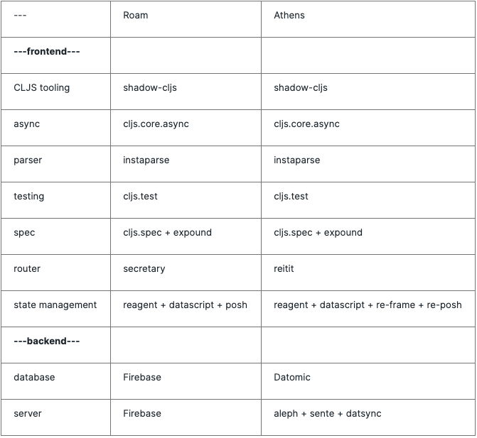

# Athens

Open-Source [Roam](http://roamresearch.com/). For more background, please read the [Athens FAQ](https://roamresearch.com/#/app/ego/page/OaSVyM_nr) on my public Roam.

# Contributing

Please refer to [CONTRIBUTING.md](https://github.com/athensresearch/athens/blob/master/CONTRIBUTING.md) and [CODE_OF_CONDUCT.md](https://github.com/athensresearch/athens/blob/master/CODE_OF_CONDUCT.md).

## Getting Started

Comprehensive setup instructions can be found in [CONTRIBUTING.md](https://github.com/athensresearch/athens/blob/master/CONTRIBUTING.md)
You will need:
- a `java` sdk: I'm using [openjdk 11.0.2](https://jdk.java.net/archive/)
- `lein`: Clojure's main [package manager](https://leiningen.org/) (lein installs the correct version of Clojure for you)
- `yarn` or `npm`: I'm using [yarn](https://www.npmjs.com/package/yarn)

Follow these steps:

1. Clone the repo
2. `yarn install`
3. `lein dev`
4. Go to [localhost:3000](http://localhost:3000)

## Built With

See [Athens vs Roam Tech Stack](https://roamresearch.com/#/app/ego/page/V81KJmS5L) for more background.

# Roadmap / Objectives

- to provide a self-hosted option, easily deployable on your machine
- to provide a hosted option using Datomic and their open-source license
  - if hosted, maintaining best practices (such as end-to-end encryption) and complying with standards like GDPR
- to provide a React Native mobile client
- to begin development of an open protocol for bi-directional links between Roam and other open-source alternatives

# Questions

Send a message in the #athens channel of the [Roam Slack](https://roamresearch.slack.com/join/shared_invite/enQtODg3NjIzODEwNDgwLTdhMjczMGYwN2YyNmMzMDcyZjViZDk0MTA2M2UxOGM5NTMxNDVhNDE1YWVkNTFjMGM4OTE3MTQ3MjEzNzE1MTA) or ping me on Twitter at [@tangjeff0](https://twitter.com/tangjeff0).

---

