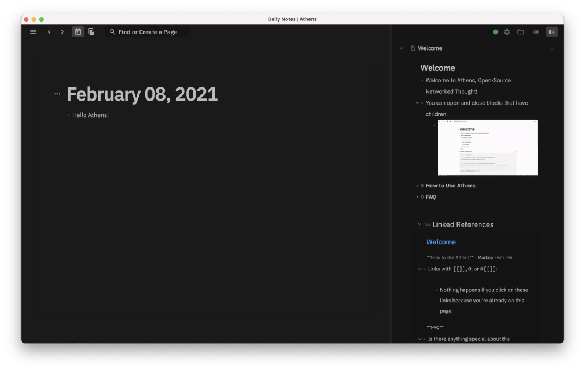
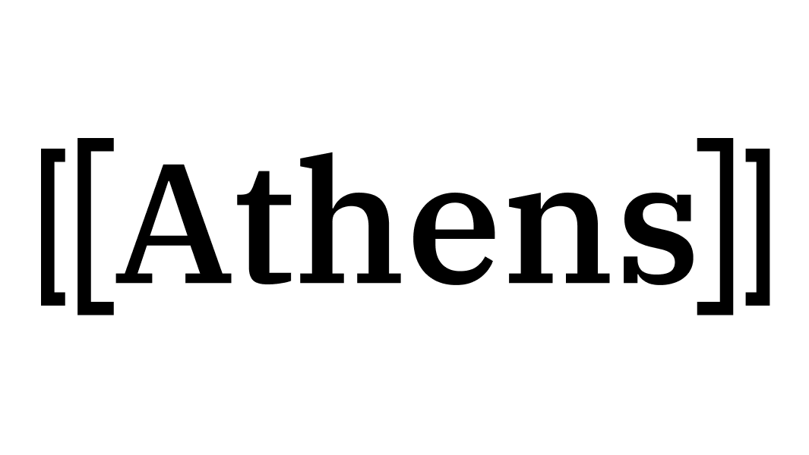

> I am the wisest man alive, for I know one thing, and that is that I know nothing.

— Socrates

# What is Athens

Athens is an open-source and local-first alternative to [Roam Research](https://roamresearch.com/). Athens lets you take notes with minimal systems, structure, and organization, freeing you to stay creative and in flow state.

Athens is a desktop app that stores all your data locally and privately on your local filesystem.

Athens is free for individuals to self-host.

# How to Use Athens

If you want to try Athens, you have a few options:

1. Build yourself locally via the directions in [Contributing](CONTRIBUTING.md) (and consider contributing!).
1. Sponsor the project on [OpenCollective](https://opencollective.com/athens) to receive the beta today.
1. Join the [Waitlist](https://forms.gle/9L1D1T7R3G7pvh1e7) to get in line to use Athens.

Some tips once you've got Athens:
- [How to use Athens](https://www.loom.com/share/ee5120d1f69d4ce0aab923de71caedd0)
- [How to file a bug report](https://www.loom.com/share/e69857c0f65f4232ab10dd78f47c4c44)
- [How to file a feature request](https://www.loom.com/share/dea9e3b3e7424f97a84e2fb81daed9c9)

# [Join Discord](https://discord.gg/GCJaV3V)

Our Discord community is a space for [collaboration and learning](CODE_OF_CONDUCT.md#values) (especially about Clojure!).

Every Sunday we have a Community Call at 11am Pacific.

We chat about other Tools for Thought, [graph visualizations](https://github.com/athensresearch/athens/issues/21), [graph DBs, decentralized DBs](https://github.com/athensresearch/athens/issues/9), blockchains, [open protocols, knowledge markets](https://github.com/athensresearch/athens/blob/master/VISION.md#a-protocol-for-knowledge-markets), [education](https://github.com/athensresearch/athens/blob/master/doc/ClojureFam.md), philosophy, and governance.

We also love [Future of Coding topics](https://futureofcoding.org/episodes/046#question-thirteen-what-foc-topics-interest-you-most) such as visual programming, live programming, [local first apps](https://www.inkandswitch.com/local-first.html), [end-user programming](https://www.inkandswitch.com/end-user-programming.html), programming language theory, HCI, AR / VR / spatial software, AI / ML, and so on and so forth.

Ultimately, however, we recognize technology does not exist in a vaccum. Technology shapes society as much as vice versa. There are never no externalities. If you are interested in "**sensemaking**" towards a better world, please join us!

# Links

To learn more about this project, please see:

- [Our Notion](https://www.notion.so/athensresearch/Athens-Research-67e1c6068cb449ff935d10e882fd9b05) — helpful docs like tutorials, updates, meeting notes
    - [Athens Joins Y Combinator](https://www.notion.so/athensresearch/Athens-Joins-Y-Combinator-86b9dfa30f4141e5bf072fad8f95a6c7)
    - [MVP Update, Funding, and Why I Started Athens](https://www.notion.so/athensresearch/MVP-Update-Funding-and-Why-I-Started-Athens-e68822f0c3654660ae621cdcbf932bc4)
- [Vision](VISION.md) — individual and collective memexes — computing and the Web as originally promised
- [Governance](GOVERNANCE.md) — BD + Core Team + Guardians + Athenians
- [Code of Conduct](CODE_OF_CONDUCT.md) — our values and guidelines, AKA how to be an awesome Athenian

---

