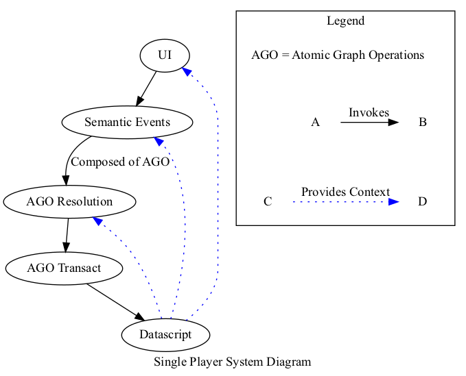
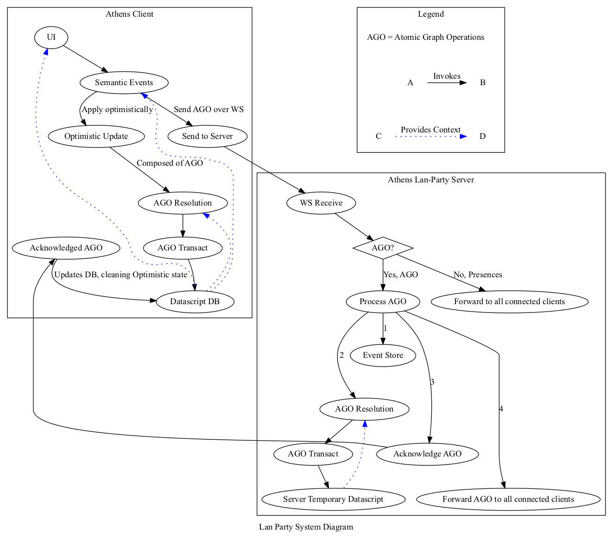

# 17. Athens System Design

Date: 2021-11-24

## Status

Accepted

## Context

This ADR provides overview of current system design in Athens Single-Player and Lan-Party.  
It serves as documentation.

## Decision

### Single Player

This is Athens Client used for Personal Knowledge Management without connecting to Server.  

Everything happens in one process.

User Interface actions are represented as Semantic Events (our re-frame events),  
which in turn gets to be translated to Atomic Graph Operations.

Atomic Graph Ops are Resolved in context of clients Datascript DB,  
then transacted to the same DB. End of the story.

### Lan Party

This is Athens Client used for Collaborative Knowledge Management, that is connected to Athens Lan Party server.  

In Lan Party context, Athens Clients behaves a bit differently.  
Atomic Graph Operations are applied to clients Datascript DB optimistically and dispatched to Lan Party Server over Athens Events Protocol.

Server on receiving Event from connected client, decides 1st if event is AGO or presence.

In case of AGO event:

* Resolve AGO in context of temporary Datascript DB
* Transact AGO resolution to temporary Datascript DB
* Acknowledge Event to client
* Forward AGO event to all connected clients
* Store in Append only Event Store
    
In case of Presence Event, server updates internal presence state,  
and forwards it to all connected clients.

## Consequences

Atomic Graph Operation Resolution and transacting mechanisms are shared between client and server code,  
doing it this way provides us guarantees about correctness in both cases.
