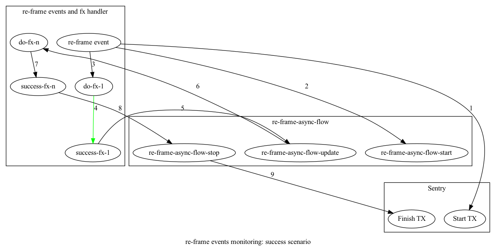
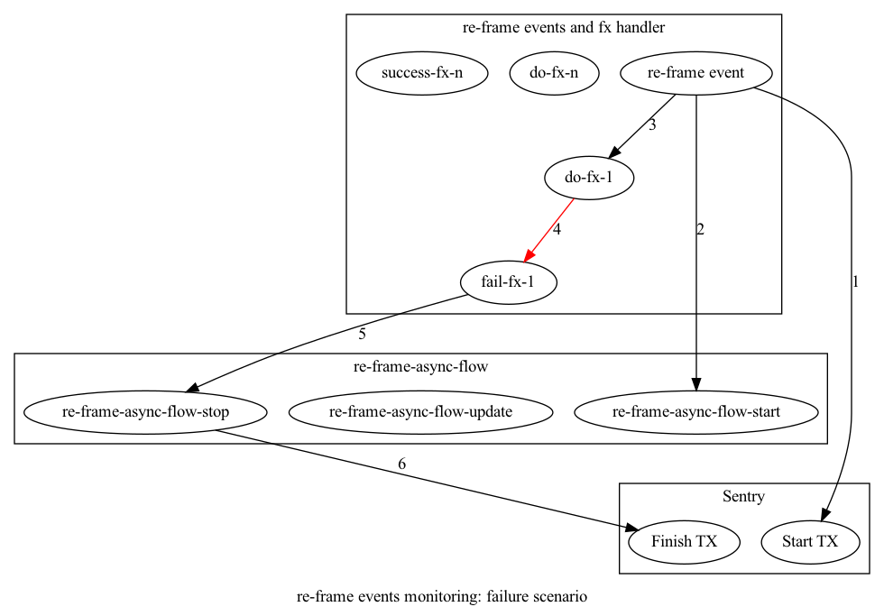

# 23. Frontend Performance Monitoring

Date: 2022-03-02

## Status

Proposed

## Context

After implementing Collaborative Knowledge Graphs, our Graphs started growing very fast,  
which exposed all sorts of performance problems.

To solve the problem in a sustainable way, we want to measure and report our performance.

While we know that both Backend and Frontend experience performance problems,  
we've decided to first tackle Frontend performance, because it's experienced by all
users, and everytime a user opens and writes to the app.

## Approach

We've decided to capture performance monitoring data in [[Sentry]] for 2 reasons:  
- It allows for tracking *spans* (portions) of transactions, not only transactions
- It will allow us to correlate backend performance with frontend performance

We have 3 groups of operations that cost us time on the frontend:
- [[re-frame]] event processing, including effects
- Rendering
- [[DataScript]] updates and reads (those are usually part of previous 1)

Description of the above follows.

### Monitoring (([[re-frame]] event processing, including effects))

The way [[re-frame]] events are advised to be implemented is to return data that represents further processing,  
which usually takes a fraction of total event processing time.

Here's successful async event processing: 

Here's failure async event processing:

### Monitoring ((Rendering))

We've tried attacking the problem of measuring Rendering performance with [[HOC]] (Higher Order Component). 
This leverages [[React.js]]'s ability to use lifecycle hooks to measure when a component is setup and when it's finished rendering,  
which allows us to capture the time it took to render.

### Monitoring (([[DataScript]] updates and reads (those are usually part of previous 1)))

We want to monitor timing of all [[DataScript]] usage because it's our data access layer, which is usually where apps spend a lot of time.  
To do so we've decided to go with a `defn` [macro](https://blog.klipse.tech/clojure/2019/03/08/spec-custom-defn.html#args-of-defn-macro).

We did consider using a wrapper macro, which would be a simpler macro to maintain,  
but it required all call sites to maintain the wrapping, which adds a lot of accidental complexity.

## Insights from MVP

### Implicit transactions

These are spans that get automatically upgraded to Sentry TXs, because there wasn't a TX already present.

We can't implicitly capture transactions. We have to be explicit, because of Sentry's TX quota:
- We've been automatically promoting Sentry spans that don't have running Sentry TX to TX itself.
- This explodes the amount of TXs reported and goes over our quota.
- This needs to be reduced significantly, or totally.

### Potential followup: Profiler API

[[React.js]] offers a Profiler API, also using a [[HOC]] approach, with the [onRender Callback](https://reactjs.org/docs/profiler.html#onrender-callback) that handles rendering information.
However, it's not clear how we could integrate it with Sentry, because Sentry measures times itself,  
while the Profiler API offers summary of execution times.

Profiler API is by default turned off in production builds.

Here is how to enable it in production builds https://gist.github.com/bvaughn/25e6233aeb1b4f0cdb8d8366e54a3977.

### Managing Sentry's TXs & spans ain't easy, but it's necessary

In Reagent everything is event-driven, pretending like it's asynchronous model,
but we run on JS, which is single-thread.

To avoid needing to pass Sentry TXs & Spans, we need make them omnipresent.
This is why we need to manage them ourselves.

Otherwise, we'd have to pass Sentry TX and Span as arguments to every fn call that we want to potentially monitor.

### Surprising insights

Having deep perf monitoring allows us to discover performance improvements we have not been looking for,
like the fact that `block-nil-eater` middleware is constant overhead.
In hindsight this is obvious, but nobody suspected it.

## Decision

We'll continue monitoring frontend performance.

We've identified [[Frontend Performance Monitoring]] to be ((Musts | Expected needs)) as in [[Kano Framework]],
which means we can't suck at it, but it also makes little sense to be extraordinary at it.

## Consequences

We get to see how Athens performs for end users.  
And we get to see that continuously.
